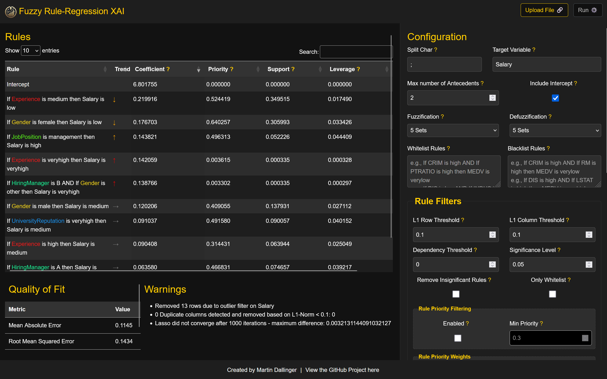

# Fuzzy-Regression XAI


Bachelor Thesis, Artificial Intelligence @ Johannes Kepler University\
Author: Martin Dallinger (martin.dallinger@outlook.com)\
Linz Institute of Technology Secure and Correct Systems Lab\
Supervisor: Univ.-Prof. Priv.-Doz. DDI Dr. Stefan Rass

This project offers a regression-based approach over fully explainable fuzzy rules (Mamdani FIS) to discover biases in arbitrary datasets.

More details (especially technical documentation) will follow in the next months.

# Web-App 

The web-app runs in your browser🎉. https://xai.martin-dallinger.me



# Overview

Fuzzy-Regression XAI is a regression-based approach utilizing fully explainable fuzzy rules (Mamdani Fuzzy Inference System) to discover and analyze biases in arbitrary datasets with a **numeric target variable**. This tool leverages fuzzy inference systems to create simple basis functions. One such basis function could mean `If NumberOfRooms is high AND If District is downtown then Price is veryhigh`, which would automatically be generated by the tool and assigned a coefficient to show, how important this rule is in the regression system.

# Notes

It is recommended to remove outliers, especially on the target variable (can be performed by using `outlier_filtering`)! This is important, since the fuzzy sets (veryhigh, high, ...) are spread with equal size.

# Installation
## Prerequisites
- Suggested Node.js version: `22.11.0`
- npm (Node Package Manager) v6.0 or higher

Install dependencies with `npm install`.

## Usage
One can either choose to serve this project in an API or to compile it and import it in the browser.

First, clone the repo and get the necessary dependencies:
```bash
git clone https://github.com/S0urC10ud/xai-fuzzy-regrules
cd xai-fuzzy-regrules
npm i
npm run build:(web or node)
```

### Running as API Server
Start the server:
```
npm run build:node
npm start
```

Furthermore, the following debugging configuration can be used with VS-Code:
```json
{
    "version": "0.2.0",
    "configurations": [
        {
        "type": "node",
        "request": "launch",
        "name": "Launch TypeScript (Dev)",
        "runtimeExecutable": "node",
        "runtimeArgs": ["--inspect"],
        "args": ["-r", "ts-node/register", "src/api/index.ts"],
        "sourceMaps": true,
        "outFiles": ["${workspaceFolder}/dist/**/*.js"],
        "skipFiles": ["<node_internals>/**"]
        },
        {
        "type": "node",
        "request": "launch",
        "name": "Launch JavaScript (Prod)",
        "program": "${workspaceFolder}/dist/api/index.js",
        "runtimeArgs": ["--inspect"],
        "sourceMaps": true,
        "skipFiles": ["<node_internals>/**"],
        "outFiles": ["${workspaceFolder}/dist/**/*.js"]
        }
    ]
}
```

### Running the Browser Frontend
The UI currently WIP.

To run the frontend first bundle it:
```
npm run build:web
```

And then serve it with the web-server of your choice (e.g. `http-server`) in the root-directory of this project.

# API Documentation

## POST /api/upload
Uploads a CSV file along with metadata to process the data and generate regression models.
Request:

Headers:
    Content-Type: multipart/form-data

Body:
- csvFile: The CSV file to be uploaded.
- metadata: JSON string containing configuration parameters.

Warning: If you use regularization, the t-Test results (pValue) cannot be considered entirely correct!

Example request metadata:
```json
{
  "split_char": ";", // split character for the CSV-file
  "target_var": "MEDV", // target column from csv file to explain
  "lasso": {
    "regularization": 0.00001, // to avoid a singular matrix for inversion - should not be necessary when correctly removing linear dependencies
    "max_lasso_iterations": 10000, // default is 10000 - lasso is applied iteratively until convergence or until this max-iterations-counter is hit
    "lasso_convergance_tolerance" // default is 1e-4, this is the threshold for the absolute value of difference between beta[i-1] and beta[i] until we say it converged
  },
  "rule_filters": {
    "l1_row_threshold": 0.1, // row/(2*threshold) will be serialized to a string and checked for duplicates
    "l1_column_threshold": 0.1, // same as l1_row_threshold but column-wise 
    "dependency_threshold": 0.02, // if the residual from the Gram-Schmidt orthogonalization has a norm lower than this value, the vector is considered being linearly dependent - set to 0 to disable
    "significance_level": 0.05, // for the t-test with H0 that the coefficient Beta=0
    "remove_insignificant_rules": false, // remove rules that are not statistically significant
    "only_whitelist": false, // disables the rule generation and forces the system only to use the specified whitelist-rules
    "only_one_round_of_statistical_removal": false, // tradeoff runtime duration and how many rules get filtered
    "only_one_round_of_linearity_removal": false, // tradeoff runtime duration and how many rules get filtered
    "rule_priority_filtering": {
        "enabled": true, // default: false,  filters for minimum rule priority (computation described in rule_priority_weights), 
        "min_priority": 10 // all rules with a priority geq this value will survive (but intercept is exempted) - NOTE: Priorities can also be negative, because leverage may be negative
    }
  },
  "numerical_fuzzification": ["low", "medium", "high"], // defines the fuzzy sets - possible values: verylow, low, mediumlow, medium, mediumhigh, high, veryhigh
  "numerical_defuzzification": ["verylow", "medium", "veryhigh"], // same as above
  "variance_threshold": 1e-5, // Columns with a variance smaller than this value can be removed, set to 0 to disable
  "remove_low_variance": false, // Defaults to false, toggles only warn vs. actually remove columns below variance threshold
  "include_intercept": true, // Defaults to true; Determines, whether at absolute 0 the model should be forced to go to 0 or if an intercept can be used to offset it - this parameter cannot be removed from colinearities or the significance-test
  "outlier_filtering": {
    "AGE": { // column name
      "method": "VariableBounds",
      "min": 0,
      "max": 100
    },
    "TAX": { 
      "method": "IQR",
      "outlier_iqr_multiplier": 4
    }
  },
  "num_vars": 2, // number of antecedents to combine - will scale compute quadratically
  "whitelist": [ // these rules will definitely be included
    "If CRIM is high AND If PTRATIO is high then MEDV is verylow",
    "If DIS is low AND If INDUS is high then MEDV is verylow"
  ],
  "blacklist": [ // these rules will be removed from the generation
    "If CRIM is high AND If RM is high then MEDV is verylow",
    "If DIS is high AND If LSTAT is high then MEDV is veryhigh"
  ],
  "rule_priority_weights": { // weighting for ordering the rules - the order is important for the linear dependency threshold removal
    "support_weight": 1, // support_weight * rule.support (see association rule mining theory) +
    "leverage_weight": 10, //  leverage_weight * rule.leverage (see association rule mining theory) +
    "num_antecedents_weight": 1, // num_antecedents_weight * (1 / numAntecedents) + 
    "whitelist_boolean_weight": 1000 // + whitelist_boolean_weight if the rule is a whitelisted rule
  },
}
```

Example response/result for the Boston housing dataset:

```json
{
    "mean_absolute_error": 0.8471479103019413,
    "root_mean_squared_error": 1.1770638617902667,
    "r_squared": 0.9835212780078919,
    "mean_absolute_percentage_error": 4.445211660386882,
    "sorted_rules": [
        {
            "title": "Intercept",
            "coefficient": 10.48345290204791,
            "isWhitelist": true,
            "support": 0,
            "leverage": 0,
            "priority": 0,
            "pValue": 0.8698225598608367,
            "secondaryRules": []
        },
        {
            "title": "If CRIM is high then MEDV is verylow",
            "coefficient": 22.158245498984996,
            "isWhitelist": false,
            "support": 0.005988023952095809,
            "leverage": 0.004649383866996546,
            "priority": 1.058469886574157,
            "pValue": 0.014328487105502719,
            "secondaryRules": [
                "If CRIM is high AND If ZN is low then MEDV is verylow",
                "If CRIM is high AND If CHAS is low then MEDV is verylow",
                "If CRIM is high AND If RAD is high then MEDV is verylow",
                "If CRIM is high AND If TAX is high then MEDV is verylow"
            ]
        },
        {
            "title": "If NOX is low then MEDV is veryhigh",
            "coefficient": 12.332376652806392,
            "isWhitelist": false,
            "support": 0.029940119760479042,
            "leverage": 0.004442213377635947,
            "priority": 1.1043023732973176,
            "pValue": 0.00007447071149968565,
            "secondaryRules": []
        },
        {
            "title": "If AGE is medium then MEDV is veryhigh",
            "coefficient": 6.888549572472112,
            "isWhitelist": false,
            "support": 0.023952095808383235,
            "leverage": -0.0006533838510603511,
            "priority": 1.0413703531061629,
            "pValue": 0.005897984894014829,
            "secondaryRules": []
        },
        {
            "title": "If PTRATIO is low then MEDV is veryhigh",
            "coefficient": 6.310368076764203,
            "isWhitelist": false,
            "support": 0.033932135728542916,
            "leverage": 0.02653774287751842,
            "priority": 1.33324170023227,
            "pValue": 0.5002152617430908,
            "secondaryRules": [
                "If CRIM is low AND If PTRATIO is low then MEDV is veryhigh"
            ]
        },
        {
            "title": "If INDUS is high AND If TAX is medium then MEDV is verylow",
            "coefficient": 6.085750330758465,
            "isWhitelist": false,
            "support": 0.031936127744510975,
            "leverage": 0.011856526468022037,
            "priority": 0.6824375201692423,
            "pValue": 0.12692183753826303,
            "secondaryRules": []
        },
        {
            "title": "If RM is high then MEDV is veryhigh",
            "coefficient": 6.006023886928234,
            "isWhitelist": true,
            "support": 0.04790419161676647,
            "leverage": 0.044334484723168435,
            "priority": 101.53915323046522,
            "pValue": 0.08148015949236465,
            "secondaryRules": []
        },
        {
            "title": "If INDUS is low AND If B is high then MEDV is veryhigh",
            "coefficient": 5.508659764757984,
            "isWhitelist": false,
            "support": 0.043912175648702596,
            "leverage": 0.02019912271265852,
            "priority": 0.7898155784239904,
            "pValue": 0.18740070573307377,
            "secondaryRules": []
        },
        {
            "title": "If CRIM is medium then MEDV is verylow",
            "coefficient": 5.270527930879079,
            "isWhitelist": false,
            "support": 0.021956087824351298,
            "leverage": 0.01660152748395425,
            "priority": 1.2099274504882451,
            "pValue": 0.332045349875171,
            "secondaryRules": []
        },
        ...
        {
            "title": "If NOX is medium then MEDV is verylow",
            "coefficient": -12.136961933387964,
            "isWhitelist": false,
            "support": 0.1996007984031936,
            "leverage": 0.07599969721236172,
            "priority": 2.1591985689300044,
            "pValue": 0.0001328508728710709,
            "secondaryRules": []
        },
        {
            "title": "If RAD is low AND If PTRATIO is low then MEDV is veryhigh",
            "coefficient": -13.864127070210554,
            "isWhitelist": false,
            "support": 0.033932135728542916,
            "leverage": 0.02653774287751842,
            "priority": 0.8332417002322701,
            "pValue": 0.242828874317786,
            "secondaryRules": []
        },
        {
            "title": "If CRIM is high AND If PTRATIO is high then MEDV is verylow",
            "coefficient": -19.82549134359085,
            "isWhitelist": true,
            "support": 0.005988023952095809,
            "leverage": 0.004649383866996546,
            "priority": 100.55846988657416,
            "pValue": 0.026240505075683096,
            "secondaryRules": []
        }
    ],
    "warnings": [
        "Removed 5 rows due to outlier filter on TAX",
        "Added 4 whitelist rules to the rule set.",
        "Removed 2 rules based on the blacklist.",
        [
            {
                "log": "Removed rule \"If PTRATIO is medium then MEDV is medium\" due to linear dependence (small Cholesky diagonal value 8.699286175064224e-1).",
                "top3LinearDependentRules": [
                    {
                        "rule": "Intercept",
                        "coefficient": 615.5326910502068
                    },
                    {
                        "rule": "If PTRATIO is medium then MEDV is medium",
                        "coefficient": 0.8699286175064224
                    },
                    {
                        "rule": "If CRIM is high AND If PTRATIO is high then MEDV is verylow",
                        "coefficient": 0.020747847416468724
                    }
                ]
            },...],
        "Degrees of freedom: 165"
    ]
}
```

# License
This project is licensed under the GNU GPL v3.

# Contact
For any questions or suggestions, please contact me at [martin.dallinger@outlook.com](martin.dallinger@outlook.com).

# Additional Credits

assets/icon.png was generated with DALL-E.\
GitHub Copilot was used to speed up coding tedious/boilerplate parts of the project
